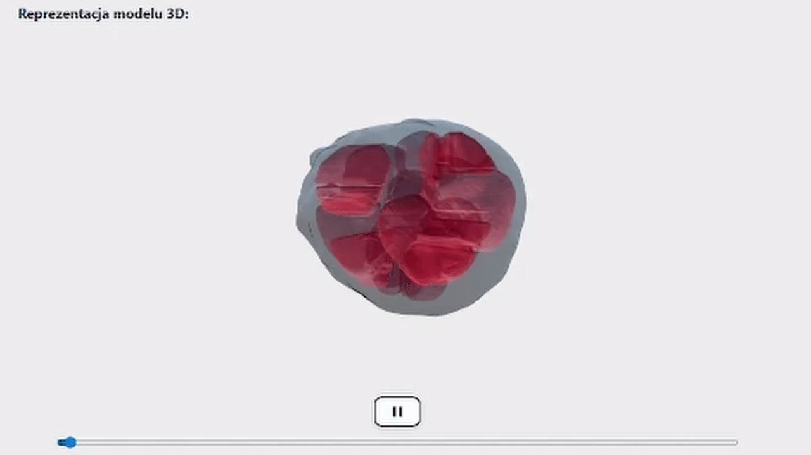

# Organoid Review System


Kompleksowa platforma do analizy, wizualizacji 3D i modelowania matematycznego organoidów.

System umożliwia przetwarzanie surowych danych mikroskopowych (`.tif`), generowanie modeli 3D (`.glb`) oraz przeprowadzanie symulacji reakcji-dyfuzji.



---
## Kluczowe Funkcjonalności

* **Przetwarzanie Obrazu:** Automatyczna konwersja stosów TIFF do meshy 3D.
* **Wizualizacja 3D:** Interaktywny podgląd organoidów w przeglądarce.
* **Modelowanie Matematyczne:** Symulacja wzrostu organoidów oparta na równaniach różniczkowych cząstkowych i modelu Reaction-Diffusion.
* **Analiza SI:** Integracja z **Google Gemini** do automatycznej interpretacji wyników symulacji i oceny jakości dopasowania modelu.
* **Metryki:** Obliczanie RMSE, AIC, korelacji Pearsona/Spearmana oraz stabilności Lapunowa.

### Wymagania
* [Docker Desktop](https://www.docker.com/products/docker-desktop/)
* Git

## How to run

```bash
git clone https://github.com/michkup08/organoid-review.git
cd organoid-review
cp .env.example .env
# Uzupełnij .env o odpowiednie hasła/klucze/ścieżki
docker-compose up --build
```

Aplikacja będzie dostępna pod adresem:
* Frontend: http://localhost:5173
* Backend: http://localhost:5000

### 1. Wgrywanie nowych danych

Aby rozpocząć analizę nowej próbki, musisz posiadać plik w formacie **`.tif`** (TIFF), zawierający sekwencję czasową (time-lapse) obrazów mikroskopowych 3D.

1. Kliknij przycisk **Dodaj** w zakładce **Dostępne zbiory danych**
2. W polu **"Nazwa nowego zbioru"** wpisz unikalny identyfikator próbki (np. `Organoid_A_01`).
3. Kliknij przycisk **"Przeglądaj"** i wskaż plik `.tif` na dysku.
4. Kliknij przycisk **"Dodaj zbiór danych do eksperymentu"**.

> **Uwaga:** Proces przetwarzania może potrwać od kilku do kilkunastu minut w zależności od rozmiaru pliku. W tym czasie system:
> * Generuje poglądową siatkę 3D (`.glb`).
> * Uruchamia model reakcji-dyfuzji.
> * Oblicza metryki.

---

### 2. Przeglądanie listy organoidów

W widoku głównym znajduje się lista wszystkich wgranych próbek.

Kliknij kafelek z interesującym Cię organoidem, aby przejść do **widoku szczegółowego**.

---

### 3. Wizualizacja 3D i Przekroje

W widoku szczegółowym centralnym elementem jest interaktywny podgląd organoidu.

#### Sterowanie widokiem:
* **Obracanie:** **LPM**
* **Przesuwanie (Pan):** **PPM**
* **Przybliżanie (Zoom):** **ŚPM**

#### Panel "Ortho Slices" (Przekroje ortogonalne):
Po prawej stronie wizualizacji znajdziesz suwaki kontrolujące przekroje modelu:
* **X / Y / Z Cut:** Przesuwanie suwaków pozwala "zajrzeć" do środka organoidu, ucinając jego fragmenty wzdłuż osi X, Y lub Z.
* Pozwala to na ocenę gęstości i struktury wewnętrznej, która nie jest widoczna na powierzchni.

---

### 4. Analiza Wykresów i Metryk

Poniżej wizualizacji 3D znajdują się wykresy generowane przez model matematyczny:

#### A. Global Intensity Growth (Wzrost Intensywności)
Porównuje rzeczywiste dane pomiarowe z modelem teoretycznym.
* **Linia Niebieska (Real):** Rzeczywista suma intensywności (biomasy) w czasie.
* **Linia Czerwona (Model):** Funkcja dopasowana przez algorytm.
* *Interpretacja:* Im bliżej siebie są te linie, tym lepiej model opisuje wzrost organoidu.

#### B. Lyapunov Exponent (Stabilność)
Wykres przedstawia logarytm odległości między trajektorią oryginalną a zaburzoną.
* **Lambda ($\lambda$):** Jeśli $\lambda > 0$, układ wykazuje cechy chaosu/wrażliwości na warunki początkowe.
* **Trend:** Liniowy wzrost oznacza wykładnicze rozbieganie się trajektorii.

#### C. Optimization History
Pokazuje, jak algorytm (Nelder-Mead) dobierał parametry w kolejnych iteracjach:
* **$D$ (Dyfuzja):** Współczynnik rozprzestrzeniania się.
* **$\rho$ (Rho):** Współczynnik reakcji (wzrostu).
* *Stabilizacja wykresu oznacza znalezienie optymalnych parametrów.*

---

### 5. Interpretacja AI

System oferuje automatyczną interpretację wyników.

1. Kliknij przycisk **"Analizuj wyniki modelu"**.
2. System wyśle dane numeryczne (RMSE, R2, AIC, Lambda) do modelu **Google Gemini**.

**Otrzymasz raport tekstowy zawierający:**
* Ocenę jakości dopasowania modelu (czy dane są wiarygodne).
* Interpretację biologiczną (czy wzrost jest stabilny, czy chaotyczny).
